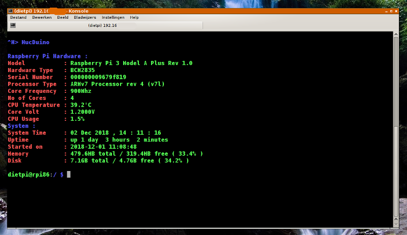

# piSystemInfo
Raspberry Pi mini cli (command line interface) system info.

* Written in Python
* Tested on Raspberry Pi Model B, Zero W, 3 Model A Plus and 3 Model B Plus. 

## Getting started: ##
* Requirements : 

* `sudo pip install psutil`
* `sudo pip install git+https://github.com/nicmcd/vcgencmd.git`

## Starting : ##
* change to the **piSystemInfo** directory
* chmod piSystemInfo.py to 777
* start script on the command line:

  `sudo python piSystemInfo.py`

## Accessing the Dashboard: ##
* Since the servlet is running locally, you can access the dashboard by navigating to **http://[you ip]:5000** through your web browser.

## useful links: ##
*  https://github.com/giampaolo/psutil
*  https://github.com/nicmcd/vcgencmd
